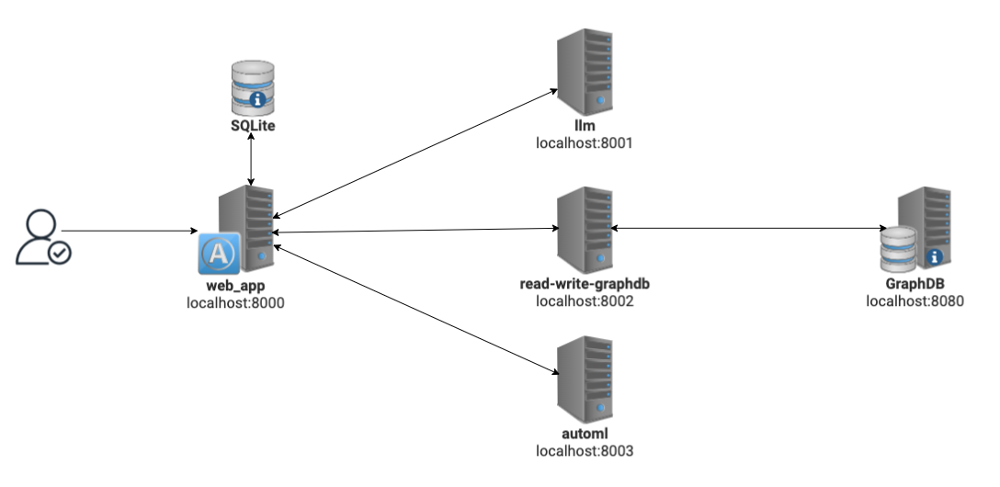

# extremexp-prototype
## System Architecture


## Project Setup

### Set up your virtual environment
 ```bash
  pip install virtualenv
  python3.11 -m venv prototype
  source prototype/bin/activate
```
### Install and Configure GraphDB
- Refer to https://graphdb.ontotext.com/documentation/10.7/how-to-install-graphdb.html for installation instructions.
- Once you install GraphDB, set the port to **8080** for the GraphDB instance.
- Start GraphDB server.

### Populate GraphDB repository with the KnowledgeBase.nt
- Install requests library :
```bash
pip install requests
```
- Create GraphDB repository (Default name is test-repo. Refer to the create_graphdb_repository.py to change settings):
```bash
python read-write-graphdb/utils/create_graphdb_repository.py
```
- Load data into created repository (local file path to GraphDB server directory is required):
```bash
  python read-write-graphdb/utils/import_file_to_graphdb_repository.py <$user.home/graphdb-import/>
```

### Store your API keys
Make sure you have ```.env``` file in the **llm folder** with your API keys stored.
  ```
  OPENAI_API_KEY=<YOUR OPENAI_API_KEY>
  LlamaAPI_KEY=<LlamaAPI_KEY>
  ```
For more information on how to obtain API Keys, refer to : [OpenAI](https://platform.openai.com/docs/quickstart) and [LLama AI](https://docs.llama-api.com/api-token).
  
### Start servers
```bash
   chmod +x start_servers.sh
    ./start_servers.sh
```
The **start_servers.sh** script will automatically install the necessary requirements and start the following servers:
- web_app
- llm
- read-write-graphdb
- automl

### Navigate to the Main Application (web_app)
   In order to engage with application you should navigate your web browser to
`http://localhost:8000` or you can use `curl`.

```bash
curl -X GET http://localhost:8000
```

## Usage Guide
